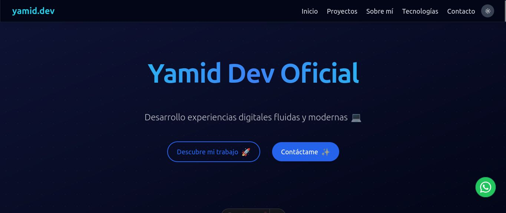
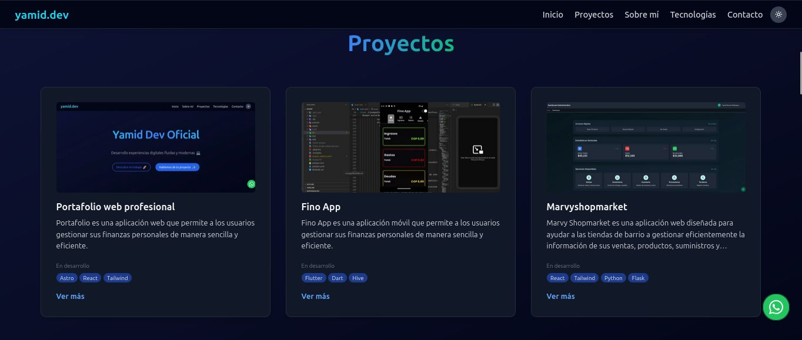
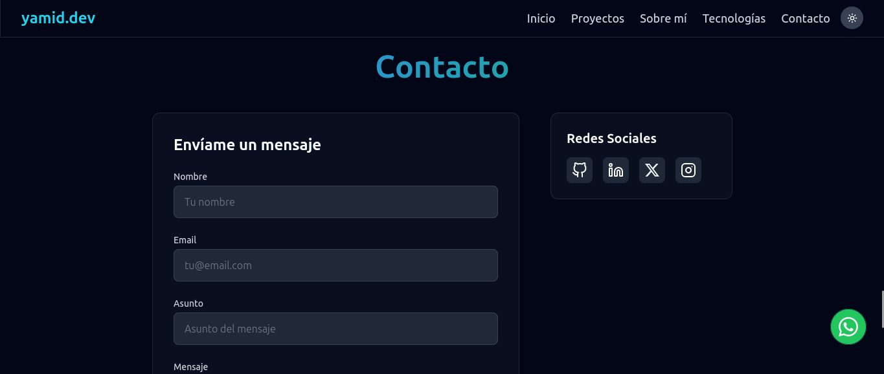

# 🌐 Portafolio Web de Yamid Horacio Rodríguez

¡Bienvenido a mi portafolio web! Este sitio presenta mi trayectoria profesional, proyectos destacados y las tecnologías que domino como desarrollador de software.

## 🧾 Descripción

Este proyecto contiene el código fuente de mi sitio personal, accesible en [yamid.dev](https://www.yamid.dev/). En él comparto información sobre mi formación, experiencia laboral, proyectos realizados, artículos técnicos y formas de contacto.

## ✨ Características

- **Secciones principales**:
  - **Sobre mí**: Presentación personal y trayectoria.
  - **Proyectos**: Galería de trabajos destacados con detalles y capturas.
  - **Blog**: Publicaciones dinámicas gestionadas desde WordPress como Headless CMS.
  - **Currículum**: CV descargable en PDF actualizado.
  - **Tecnologías**: Herramientas y lenguajes que utilizo y estoy aprendiendo.
  - **Contacto**: Formulario de contacto directo y enlaces a redes sociales.

- **Diseño responsivo**: Adaptado a todo tipo de dispositivos.
- **Consumo de API**: Integración con la REST API de WordPress para contenido dinámico.
- **Modo oscuro**: Interfaz amigable con tema claro/oscuro automático.

## 🛠 Tecnologías Utilizadas

- **Frontend**:
  - HTML5, CSS3, JavaScript
  - [React](https://reactjs.org/)
  - [Tailwind CSS](https://tailwindcss.com/)
  - [Astro](https://astro.build/)

- **Backend / CMS**:
  - [WordPress](https://wordpress.org/) (modo Headless)

- **Entorno y despliegue**:
  - [Docker](https://www.docker.com/)
  - [Vercel](https://vercel.com/) para frontend
  - [Hostinger](https://www.hostinger.com/) para WordPress API

## 🚀 Instalación y Uso

Puedes correr este proyecto localmente usando Docker:

### 1. Clonar el repositorio

```bash
git clone https://github.com/yamiddevofic/yamiddev.git
cd yamiddev
```

### 2. Iniciar la aplicación con Docker

Asegúrate de tener [Docker](https://docs.docker.com/get-docker/) y [Docker Compose](https://docs.docker.com/compose/install/) instalados.

```bash
docker-compose up
```

Esto construirá la imagen y servirá la aplicación en [http://localhost:4321](http://localhost:4321)

### 3. Ver los cambios en tiempo real

Gracias al volumen montado en Docker, cualquier cambio en tu código fuente se reflejará automáticamente en el navegador en modo desarrollo.

## 📸 Capturas de Pantalla

A continuación, se muestran algunas capturas del sitio en funcionamiento:

| Inicio | Proyectos | Contacto |
|--------|-----------|----------|
|  |  |  |

---

## 📁 Estructura del Proyecto

```plaintext
yamiddev/
├── public/               # Archivos públicos accesibles desde la raíz
├── src/                  # Código fuente del sitio web
│   ├── components/       # Componentes reutilizables
│   ├── layouts/          # Diseños base del sitio
│   ├── lib/              # Utilidades y lógica
│   ├── pages/            # Rutas del sitio
│   └── styles/           # Estilos personalizados
├── .dockerignore
├── .gitignore
├── astro.config.mjs
├── CHANELOG.md
├── docker-compose.yml
├── Dockerfile
├── Dockerfile.dev
├── package.json
├── postcss.config.js
├── tailwind.config.js
├── tsconfig.json
└── README.md
```

---

## 🌍 Sitio en Producción

Puedes visitar el sitio en: **[yamid.dev](https://www.yamid.dev/)**

---

## 📬 Contacto

¿Quieres hablar de tecnología, colaborar o contratarme?  
Contáctame directamente desde el sitio o a través de [LinkedIn](https://www.linkedin.com/in/yamiddevofic/).

---

## 🧠 Nota

Este proyecto está en constante evolución, al igual que mis habilidades como desarrollador. ¡Gracias por visitarlo y ser parte del camino!
